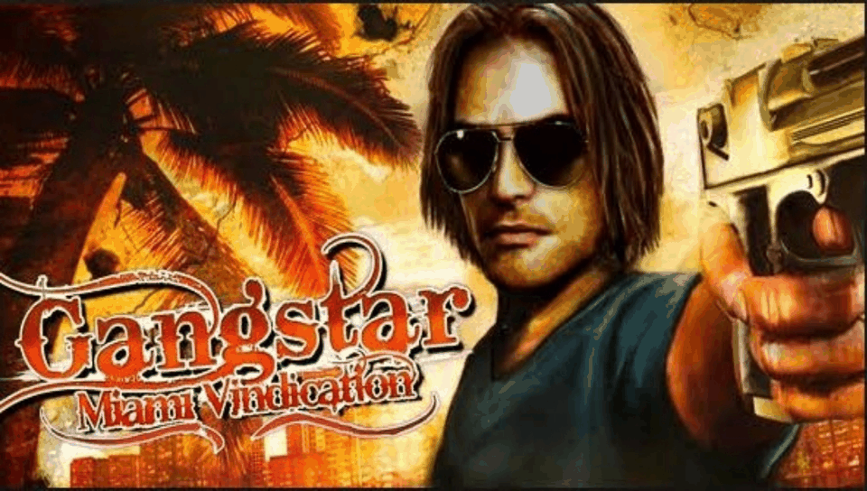

# GANGSTAR MIAMI VINDICATION — PS Vita Port

<p align="center">
  
</p>

<p align="center">
  <b>Native port of Gangstar Miami Vindication HD (Gameloft) for PlayStation Vita.</b>
</p>

<p align="center">
  
  
  
  
  
</p>

---

## 📖 Description

**Gangstar Miami Vindication** is Gameloft's open-world action game, originally released for
Android as `Gangstar-Miami-Vindication-HD.apk`. This port runs the compiled native library
(`libGangster2.so`) from the Android release directly on the PS Vita's ARM Cortex-A9 processor,
using a dynamic loader (*soloader*) and an Android environment emulation layer (*FalsoJNI*), with
[vitaGL](https://github.com/Rinnegatamante/vitaGL) providing the GLES 1.1 fixed-function
rendering backend. The `.so` has no `JNI_OnLoad`/`RegisterNatives` — every JNI entry point is
resolved by symbol name and invoked by hand, following the exact lifecycle order of the real
Android Activity/Renderer.

### 🎮 Current Status: Alpha test build — NOT playable, for testing only

The game boots, renders, and reaches third-person gameplay — driving, on-foot, vehicle
entry — but **it is not playable**: at best it is **relatively playable**, and this build
exists **strictly for testing**. Expect FPS wells down to ~1 fps, visual glitches, and fixes
that are built but unconfirmed (see "Known Issues" below and
[`RELEASES.md`](RELEASES.md) for the per-release breakdown of what is proven on hardware vs.
what still needs confirmation). Do not treat this alpha as a finished or enjoyable release.

It got here through a long bug-by-bug history (format-string crashes, a missing `HAVE_SOFTFP_ABI`
causing an all-black screen, a circular-pool GPU stall dragging it to ~9 fps, among others); see
[`port_progress.md`](port_progress.md) for the full diagnosis log, one confirmed bug at a time,
and [`PORTING_PLAN.md`](PORTING_PLAN.md) for the living engine/JNI map.

#### ✅ Confirmed on real hardware (logs + user testing)
- Boots to warning screen, menus (~60 fps), and open gameplay on foot and driving.
- Physical controls drive the game (attack/accelerate/brake/enter-car/cover/sprint + D-Pad/stick
  movement all log their synthesized touches and act in-game).
- Radio/music retry-loop settled: `stopRadio`/`playRadio` now fire on events only, not per frame.
- Intro cutscene plays from the original `intro.m4v` at full 800x500 resolution, fullscreen —
  **video fixed (user-tested)**.
- **Black characters/vehicles fixed (user-tested)** — they render correctly now.

#### 🧪 NOT yet confirmed on hardware (latest changes, need testing)
- Low-End device profile + bigger vitaGL pool + audio pre-demux (Fase 60): built green, awaiting
  a console run to prove the 1 fps wells are gone.
- Virtual buttons fully invisible while pressed/held (needs eyes on screen, L+R restores them).
- Steering the wheel with D-Pad/stick in all driving skins (diagnostic logging added; fix pending).

### ✨ What Works

- **Native ARM Execution**: `libGangster2.so` (armeabi/ARMv6, soft-float) runs directly on the
  Vita's CPU via the soloader.
- **vitaGL Graphics Pipeline**: GLES 1.1 fixed-function rendering at the native 960x544 panel
  resolution (the engine's own internal resolution is 960x480; touch input and viewport are
  remapped to match).
- **Audio**: Real backend (`sceAudioOut` + `libvorbisfile`) — short SFX decoded and cached, up to
  8+4 concurrent streamed voices for music/radio/voice with looping, independent music/SFX/VFX
  gain control.
- **Intro cutscene**: Plays the original `intro.m4v` **as shipped** (MPEG-4 Part 2, 800x500)
  via a software FFmpeg decoder (`libavcodec`/`libswresample`, no transcodes — the Vita's hardware
  decoder only handles H.264 and this project never alters original assets). Decoded at full
  resolution and stretched to the full 960x544 panel, with its AAC audio in sync, skippable with
  Cross/Start.
- **Touch + physical input**: Front touchscreen mapped to the engine's multi-touch slots. Physical
  controls drive the game by synthesizing real touches on the engine's own HUD widgets — no touch
  needed:
  | Vita control | On foot | In vehicle |
  |---|---|---|
  | Cross | Attack | Accelerate |
  | Circle | Sprint | Brake |
  | Triangle | Enter car / Enter shop | Exit car |
  | Square | Take cover | — |
  | L / R triggers | — | Brake / Accelerate |
  | D-Pad / Left stick | Move (analog drag) | Steer the wheel (rim-grab gesture) |
  | Start | Pause menu | Pause menu |
  | L+R held | Show the hidden touch buttons (100%) | Same |
- **Hidden touch buttons**: The on-screen virtual buttons/wheel/stick are hidden every frame
  (draw-skipped, ~1% alpha fallback) so they never flash or flicker when pressed, held, or when
  the HUD changes state. Hold **L+R** to bring them back at full opacity at any time.
- **Overclocked + tuned for the Cortex-A9**: CPU/Bus/GPU/GPU-Xbar clocks at their ceiling, NEON
  codegen, a tuned vitaGL speedhack set, and in-memory caches for path translation and sound
  existence checks to cut down on SD-card I/O during gameplay.

### ⚠️ Known Issues (alpha — full list in [`RELEASES.md`](RELEASES.md))

**Performance / FPS drops**
- **Wells down to ~1 fps while driving in the open world.** The world working set exhausts GPU
  memory on 4 MB texture uploads; each miss costs a ~4.2 s driver stall (frames at 2-7 fps).
  Fase 60 attacks it with the game's own Low-End profile + a bigger vitaGL pool — **unconfirmed**,
  awaiting a console run. Between wells the game runs ~13-31 fps driving, ~60 fps in menus.
- **One-time stalls:** ~8 s on the second engine frame after the intro (`Application::PostInit`),
  shader-compile bursts at the title screen / first vehicle load (frames of 0.5-16 s). Engine-side
  init on the render thread — not skippable from the loader; the on-disk shader cache makes repeat
  runs faster.

**Graphics**
- **Flatter look, no shadows (since Fase 60, unconfirmed):** the Low-End profile disables dynamic
  lighting, shadows, far water and the retro effect to save GPU. Reversible in one line if it
  looks unacceptable once the FPS wells are confirmed gone.
- ~~Characters/vehicles rendering solid black~~ — **fixed (user-tested)**.
- ~~Intro video issues~~ — **fixed (user-tested)**; plays full-res, fullscreen (stretched ~10%
  horizontally on purpose), skippable with Cross/Start.

**Controls**
- **Vehicles CANNOT be steered with the wheel via D-Pad/stick yet** (confirmed in log 059: the
  wheel exists and passes the interactable gate, but its touch center falls outside the engine's
  960x480 band). The wheel is also **semi-invisible** — virtual buttons/wheel/stick are hidden by
  design (hold **L+R** to show them at full opacity). Throttled `[input] wheel miss ...`
  diagnostics included; proper steering fix pending. On foot, D-Pad/stick movement works.
- **Lifecycle hooks not wired**: `nativePause`/`nativeResume`/`nativeAccelerometer`/`nativeDone`/
  `nativeOpenIGM`/`nativeCanInterrupt` are exported by the `.so` but not yet called from `main.c`
  — no suspend/resume or in-game menu integration yet.

---

## 📋 Prerequisites

To run this port on your PS Vita, you will need:

1. A PS Vita running Custom Firmware (**HENkaku** or **Enso**), firmware 3.60/3.65 or later
   recommended.
2. [**kubridge**](https://github.com/TheOfficialFloW/kubridge/releases) installed as a kernel
   plugin (`ur0:tai/config.txt` under `*KERNEL`).
3. [**libshacccg.suprx**](https://github.com/Rinnegatamante/ShaRKBR33D/releases/latest) installed
   in `ur0:data/`.
4. A legally obtained copy of **Gangstar Miami Vindication HD**
   (`Gangstar-Miami-Vindication-HD.apk`, package `com.gameloft.android.TBFV.GloftGMHP.ML`).

---

## 📦 Installation Instructions

1. Install the `gangstarmiamivindication.vpk` file on your console using **VitaShell**.
2. On your PC, place `Gangstar-Miami-Vindication-HD.apk` in the project root (or extract it into
   `gangstarmiamivindication_extract/`).
3. Use **psvita-port-toolkit** (the standalone tool this port is managed with) to prepare the
   asset files — open the toolkit and select "Continuar con un port existente" pointing at this
   folder.
4. Transfer the game data to `ux0:data/gangstarmiamivindication/` via FTP or USB using VitaShell,
   as-is — this project does not modify original game assets (see "Known Issues" for what that
   means for `intro.m4v` specifically).

### Final File Structure in `ux0:data/gangstarmiamivindication/`

```text
ux0:data/gangstarmiamivindication/
├── libGangster2.so     <- Native library extracted from lib/armeabi/
├── data/               <- Game data files (.bdae, .bsprite, .gmap, .bmp, intro.m4v, ...)
├── res/                <- drawable/layout/raw resources extracted from the APK
├── saves/               <- Save slots (created at runtime)
└── logs/                <- Incremental debug logs (debug_local_NNN.log)
```

---

## 🛠️ Building from Source

This port does **not** keep a local copy of `porting_tools/` — all build, deploy, log, LiveArea,
and crash-dump workflows are handled by **psvita-port-toolkit**, a standalone tool kept outside
this repository.

### Build Prerequisites

- **VitaSDK**, with `kubridge`, `vitaGL`, `vitashark`, `mathneon` available.
- CMake and Make.

### Build Steps

```bash
cmake -Bbuild .
cmake --build build
```

This produces `build/gangstarmiamivindication.vpk`. For day-to-day development (build + deploy +
crash-dump parsing), use **psvita-port-toolkit** instead of raw `cmake`/`make`.

---

## 🏗️ Project Structure

- `source/`: Native C/C++ loader (lifecycle, GLES rendering, audio, video, input, JNI resource
  loader).
- `lib/`: Auxiliary libraries (`so_util`, `falso_jni`, `libc_bridge`, `fios`, `vitaGL`,
  `vitashark`, `sha1`).
- `extras/`: LiveArea assets (`icon0.png`, `bg0.png`, `pic0.png`, `startup.png`, `template.xml`),
  plus `cpuinfo`/`meminfo` and debug scripts.
- `PORTING_PLAN.md`: Living plan — confirmed engine findings, JNI export table, checklist.
- `port_progress.md`: Bug-by-bug diagnosis log, one confirmed bug at a time.
- `RELEASES.md`: Test-build release notes — what each alpha proves on hardware, all known
  performance/graphics/FPS errors, and what is still unconfirmed.

---

## ⚖️ Disclaimer

**Gangstar Miami Vindication** is a registered trademark of Gameloft. The work presented in this
repository is not "official" or produced or sanctioned by Gameloft or any other registered
trademark mentioned in this repository.

This software does not contain the original code, executables, assets, or other
non-redistributable parts of the original game product. The authors of this work do not promote
or condone piracy in any way. To launch and play the game on their PS Vita device, users must
possess their own legally obtained copy of the game in the form of an `.apk` file.

---

## 👥 Credits and Acknowledgements

- **Gameloft**: Original developers of Gangstar Miami Vindication.
- **TheFloW**: For `so_util`, `kubridge`, and foundational techniques for loading Android
  executables on PS Vita.
- **Rinnegatamante**: For `vitaGL` and continued support to the PS Vita porting scene.
- **v-atamanenko**: For `FalsoJNI` and the `soloader-boilerplate` base template.
- **Vita Community**: To all developers and enthusiasts in the PS Vita homebrew community.

---

## License

This software may be modified and distributed under the terms of the MIT license. See the
[LICENSE](LICENSE) file for details.
